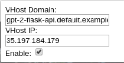
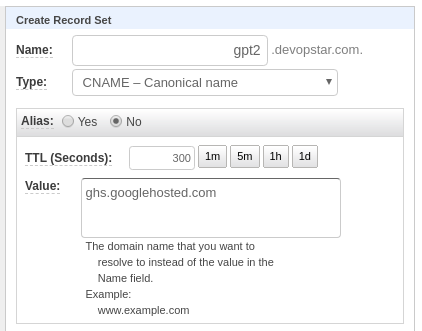

# Cloud Run - GPT2 on k8s

Containerising PyTorch models in a repeatable way. Deploy OpenAI's GPT-2 model and expose it over a Flask API. Finally deploy it to GCP repositories and publish it on a k8s cluster using Cloud Run.

First, before anything else download the model

```bash
mkdir models
curl --output models/gpt2-pytorch_model.bin https://s3.amazonaws.com/models.huggingface.co/bert/gpt2-pytorch_model.bin
```

---

## Local

---

### Local Python

```bash
python3 -m venv ./venv
source venv/bin/activate
pip install --upgrade pip
pip install -r requirements.txt
```

Then run the python flask server using the following

```bash
cd deployment
python run_server.py
```

### Conda

```bash
conda env create -f=environment.yml --n ml-flask
source activate ml-flask
```

Then run the python flask server using the following

```bash
cd deployment
python run_server.py
```

### docker-compose

#### Setup

```bash
docker-compose up --build flask
```

Go to [http://localhost:5000](http://localhost:5000)

#### Shutdown

```bash
docker-compose down -v
```

---

## GCP

---

First build and push the container to GCR (make sure to update the variables at the to of the script first)

```bash
./container_push.sh
# #!/usr/bin/env bash
# PROJECT_ID=devopstar

# # Set gcloud project
# gcloud config set project $PROJECT_ID

# # Authenticate Docker
# gcloud auth configure-docker

# # Build Container
# docker build -t gpt-2-flask-api .

# # Tag Image for GCR
# docker tag gpt-2-flask-api:latest \
#     asia.gcr.io/$PROJECT_ID/gpt-2-flask-api:latest

# # Push to GCR
# docker push asia.gcr.io/$PROJECT_ID/gpt-2-flask-api:latest
```

## Create the cluster

Making use of the following guide: [https://cloud.google.com/run/docs/quickstarts/prebuilt-deploy-gke](https://cloud.google.com/run/docs/quickstarts/prebuilt-deploy-gke)

Run `./gke.sh` after changing the project ID (and region if you want somewhere closer)

```bash
#!/usr/bin/env bash
PROJECT_ID=devopstar
REGION=australia-southeast1

gcloud beta container clusters create "$PROJECT_ID-gpt2-demo" \
    --project "$PROJECT_ID" \
    --zone "$REGION-a" \
    --no-enable-basic-auth \
    --cluster-version "1.12.6-gke.10" \
    --machine-type "n1-standard-4" \
    --image-type "COS" \
    --disk-type "pd-standard" \
    --disk-size "100" \
    --metadata disable-legacy-endpoints=true \
    --scopes "https://www.googleapis.com/auth/cloud-platform" \
    --num-nodes "3" \
    --enable-stackdriver-kubernetes \
    --enable-ip-alias \
    --network "projects/$PROJECT_ID/global/networks/default" \
    --subnetwork "projects/$PROJECT_ID/regions/$REGION/subnetworks/default" \
    --default-max-pods-per-node "110" \
    --addons HorizontalPodAutoscaling,HttpLoadBalancing,Istio,CloudRun \
    --istio-config auth=MTLS_PERMISSIVE \
    --enable-autoupgrade \
    --enable-autorepair
```

Get Istio IP

```bash
kubectl get svc istio-ingressgateway -n istio-system

export GATEWAY_IP=$(kubectl -n istio-system get service \
   istio-ingressgateway \
   -o jsonpath='{.status.loadBalancer.ingress[0].ip}')

echo $GATEWAY_IP

curl -v -H "Host: gpt-2-flask-api.default.example.com" http://$GATEWAY_IP
```

Test the endpoint by using [https://chrome.google.com/webstore/detail/virtual-hosts/aiehidpclglccialeifedhajckcpedom?hl=en](https://chrome.google.com/webstore/detail/virtual-hosts/aiehidpclglccialeifedhajckcpedom?hl=en)

Set the virtual host to `gpt-2-flask-api.default.example.com` and the IP to the one you recieved from the istio gateway.



### Delete Cluster

```bash
gcloud container clusters delete devopstar-gpt2-demo
```

## Deploy to Cloud Run (GKE)

```bash
gcloud beta run deploy \
    --image asia.gcr.io/devopstar/gpt-2-flask-api \
    --cluster devopstar-gpt2-demo \
    --cluster-location australia-southeast1-a

# Service name: (gpt-2-flask-api):  
# Deploying container to Cloud Run on GKE service [gpt-2-flask-api] in namespace [default] of cluster [devopstar-gpt2-demo]
# ⠧ Deploying new service... Configuration "gpt-2-flask-api" is waiting for a Revision to become ready.
#   ⠧ Creating Revision...
#   . Routing traffic...
```

## Deploy to Cloud Run (No GKE)

Make sure to first enable Cloud Run APIs: [https://console.developers.google.com/apis/api/run.googleapis.com](https://console.developers.google.com/apis/api/run.googleapis.com)

```bash
# Set Cloud Run region
gcloud config set run/region us-central1

# Run
gcloud beta run deploy \
    --image asia.gcr.io/devopstar/gpt-2-flask-api \
    --memory 2Gi

# Service name: (gpt-2-flask-api):  
# Deploying container to Cloud Run service [gpt-2-flask-api] in project [devopstar] region [us-central1]
# Allow unauthenticated invocations to new service [gpt-2-flask-api]? 
# (y/N)?  y

# ✓ Deploying new service... Done.
#   ✓ Creating Revision...
#   ✓ Routing traffic...
# Done.
# Service [gpt-2-flask-api] revision [gpt-2-flask-api-9eb49475-778f-4f11-8a5c-60d1ed3bd2ff] has been deployed and is serving traffic at https://gpt-2-flask-api-ulobqfivxa-uc.a.run.app
```

Navigate to URL [https://gpt-2-flask-api-ulobqfivxa-uc.a.run.app/](https://gpt-2-flask-api-ulobqfivxa-uc.a.run.app/)

### Issues with Memory

Unfortunately due to [memory limits](https://cloud.google.com/run/docs/configuring/memory-limits) it doesn't look like we can use Cloud Run for this purpose at the moment...

```bash
# 2019-04-11T13:08:14.652058Z 16%|█▌ | 80/512 [04:23<29:04, 4.04s/it]
# 2019-04-11T13:08:18.862046Z 16%|█▌ | 81/512 [04:27<29:07, 4.06s/it]
# 2019-04-11T13:08:22.155164Z 16%|█▌ | 82/512 [04:31<29:24, 4.10s/it]
# 2019-04-11T13:08:26.152569Z 16%|█▌ | 83/512 [04:34<27:35, 3.86s/it]
# 2019-04-11T13:08:30.952013Z 16%|█▋ | 84/512 [04:38<27:49, 3.90s/it]
# 2019-04-11T13:08:34.552013Z 17%|█▋ | 85/512 [04:43<29:40, 4.17s/it]
# 2019-04-11T13:08:39.355836Z 17%|█▋ | 86/512 [04:47<28:23, 4.00s/it]
# 2019-04-11T13:08:43.051604Z 17%|█▋ | 87/512 [04:52<30:02, 4.24s/it]
# 2019-04-11T13:08:46.922621ZPOST504 234 B 300 s Chrome 73  /

upstream request timeout
```

However... It does appear that a [request timeout](https://cloud.google.com/run/docs/configuring/request-timeout) can be set using the following update command. It allows a maximum of 15 minutes to be set.

```bash
# On Update
gcloud beta run services update gpt-2-flask-api \
    --timeout=15m

# On Creation
gcloud beta run deploy \
    --image asia.gcr.io/devopstar/gpt-2-flask-api \
    --memory 2Gi \
    --timeout=15m
```

And... No dice

```bash
# 15 minute request only gets halfway

# 2019-04-12T12:59:52.451876Z 55%|█████▌ | 283/512 [14:23<06:42, 1.76s/it]
# 2019-04-12T12:59:57.242055Z 55%|█████▌ | 284/512 [14:26<08:26, 2.22s/it]
# 2019-04-12T13:00:02.343637Z 56%|█████▌ | 285/512 [14:31<11:19, 2.99s/it]
# 2019-04-12T13:00:06.045967Z 56%|█████▌ | 286/512 [14:36<13:39, 3.63s/it]
# 2019-04-12T13:00:09.955038Z 56%|█████▌ | 287/512 [14:40<13:40, 3.65s/it]
# 2019-04-12T13:00:14.548409Z 56%|█████▋ | 288/512 [14:44<13:54, 3.73s/it]
```

### Custom Domain

If you have a custom domain verified already you can also attached a subdomain to the endpoint. Check / verify a domain you own to start with

```bash
gcloud domains verify devopstar.com
```

Map the service to a subdomain

```bash
gcloud beta run domain-mappings create \
    --service gpt-2-flask-api \
    --domain gpt2.devopstar.com

# Creating......done.
# Mapping successfully created. Waiting for certificate provisioning. You must configure your DNS records for certificate issuance to begin.
# RECORD TYPE  CONTENTS
# CNAME        ghs.googlehosted.com
```

In your DNS provider, add a CNAME entry for your service



Access your endpoint on the custom domain [https://gpt2.devopstar.com](https://gpt2.devopstar.com)

---

## Bugs

---

- Can't set PORT variable in GUI
  - **Error**: (Name cannot be one of reserved names (i.e. GOOGLE_CLOUD_PROJECT, GOOGLE_CLOUD_REGION, HOME, K_CONFIGURATION, K_REVISION, K_SERVICE, PATH, PORT, PWD and TMPDIR)
  - Service needs to be setup on 8080 because of this

---

## Attribution

---

- [WillKoehrsen/recurrent-neural-networks](https://github.com/WillKoehrsen/recurrent-neural-networks)
- [graykode/gpt-2-Pytorch](https://github.com/graykode/gpt-2-Pytorch)
- [Deploying a Keras Deep Learning Model as a Web Application in Python](https://morioh.com/p/bbbc75c00f96/deploying-a-keras-deep-learning-model-as-a-web-application-in-python)
